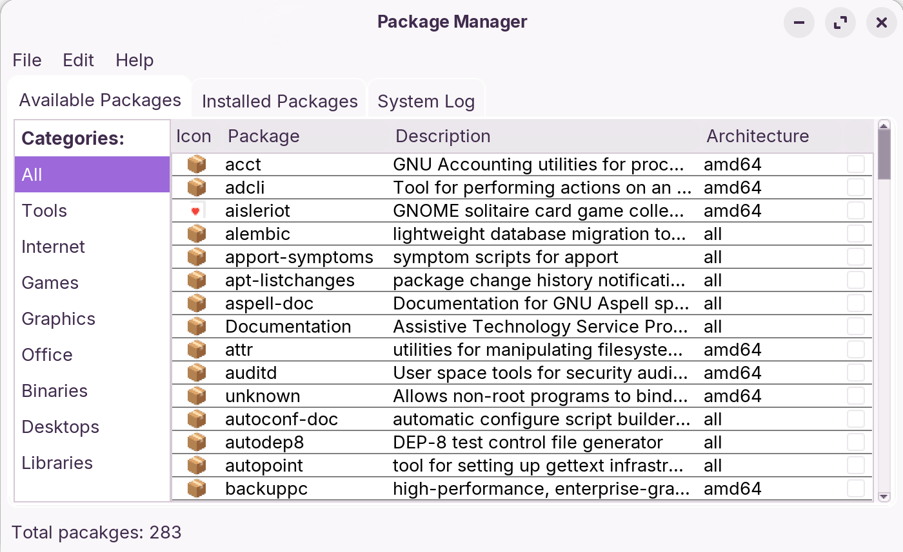
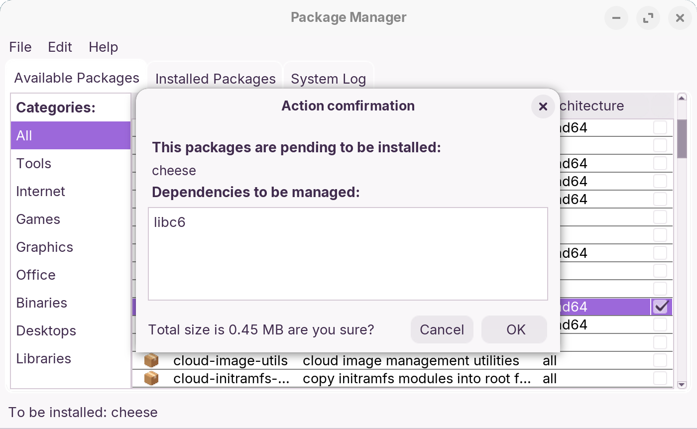
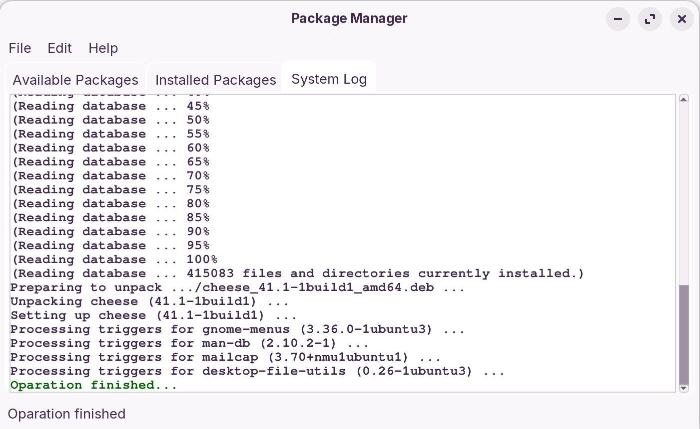

##  guiapt
guiapt is a lightweight GUI package manager for the APT backend written in Java. It aims to be a minimal, portable alternative to Synaptic, focusing on ease of use and portability across desktop environments

**The interface consists of 3 tabs:**
- One for finding available packages
- One for managing installed packages
- One for viewing apt log with timestamps
- App functions:

**App functions:**
- Option for installing/removing one or multiple packages
- Option for refreshing the package list
- Option for performing apt update/upgrade
- Options to search inside installed or available packages with the ability of filtering by name or description
- Option to quit the app

**App reliability and safety**

- Once you try to exit the app through titlebar or by using the File>Exit guiapt option while an apt operation is running, you will be prompted for confirmation. If you insist on proceeding, you will be asked by pkexec to enter your password so the app can execute `dpkg --configure -a` to prevent any damage to the operating system
- By default, the app uses the GTK Theme. By using the parameter `--legacyui` when launching the app from the terminal you can use it with the fallback motif theme so its guaranteed to work even on raw xorg

## Copyright and licensing
Copyright © AndronikosGl 2026. All rights reserved.

This project is source-available. Modification and redistribution are not permitted. This project includes a modified asset based on Google Noto Emoji (SIL Open Font License 1.1).
